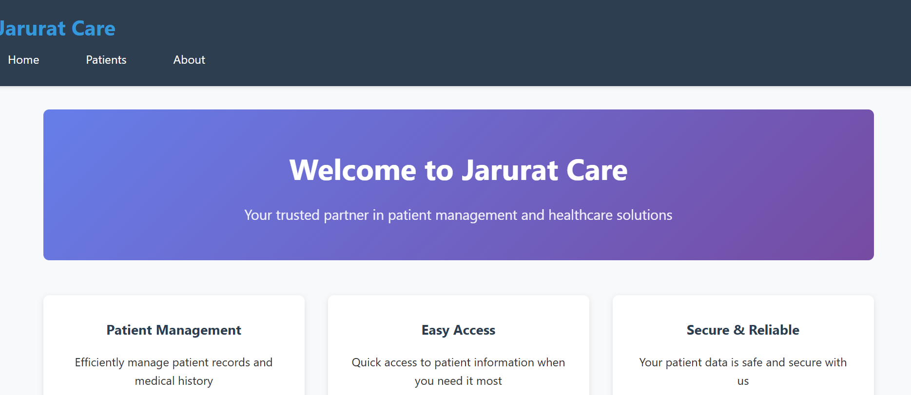
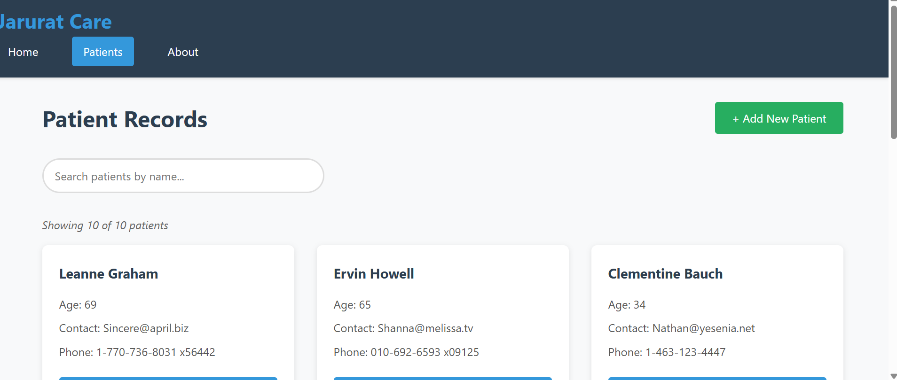
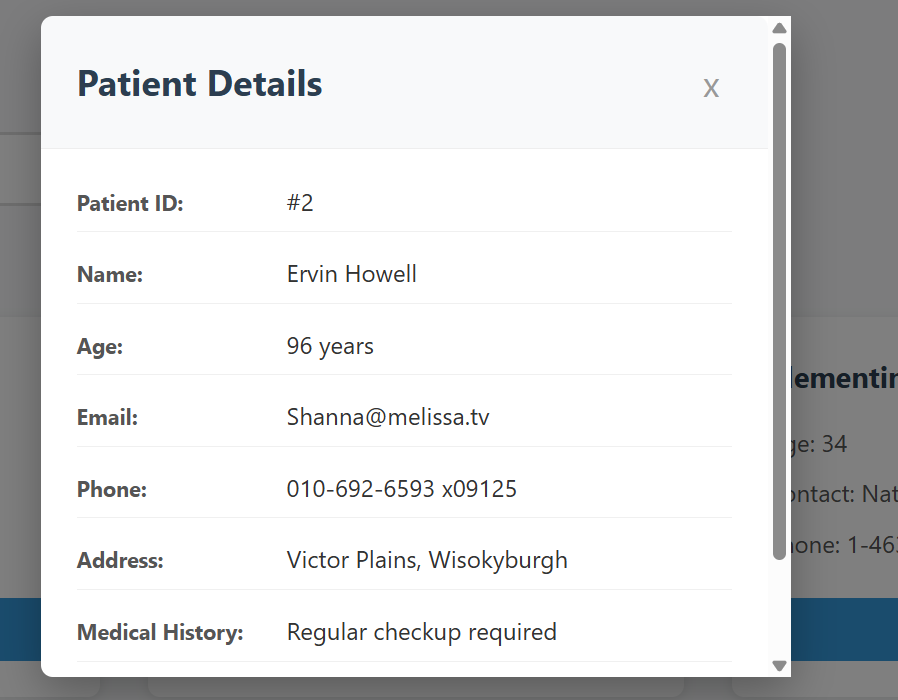
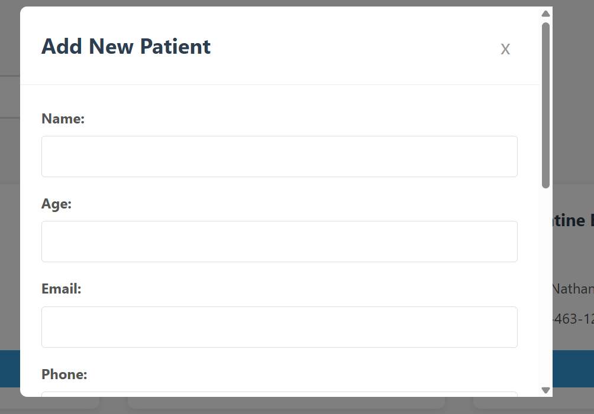
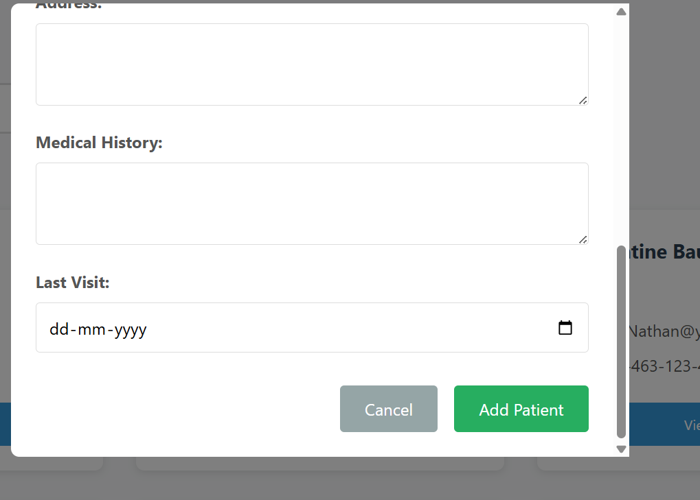
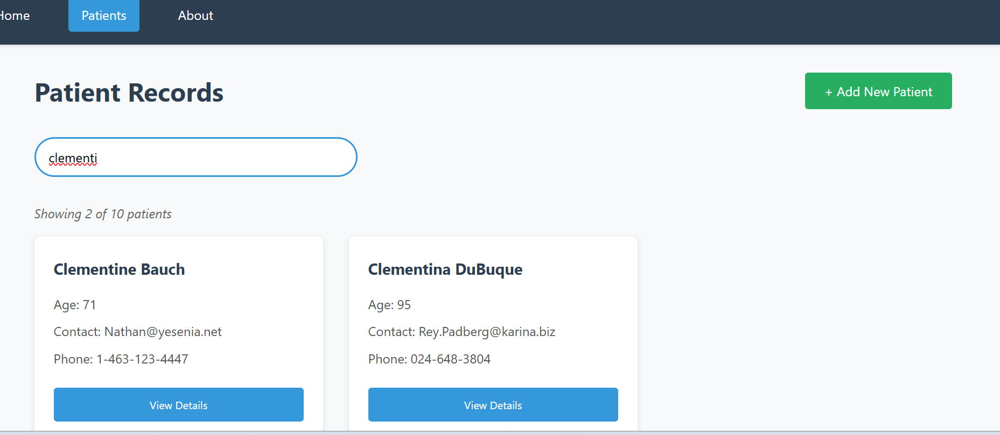
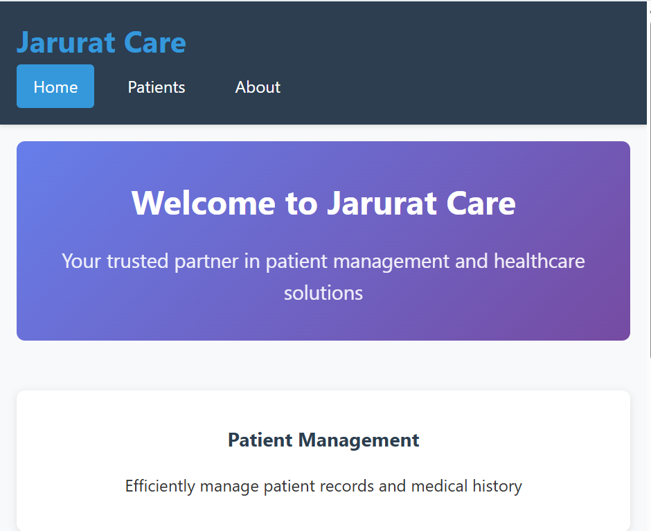
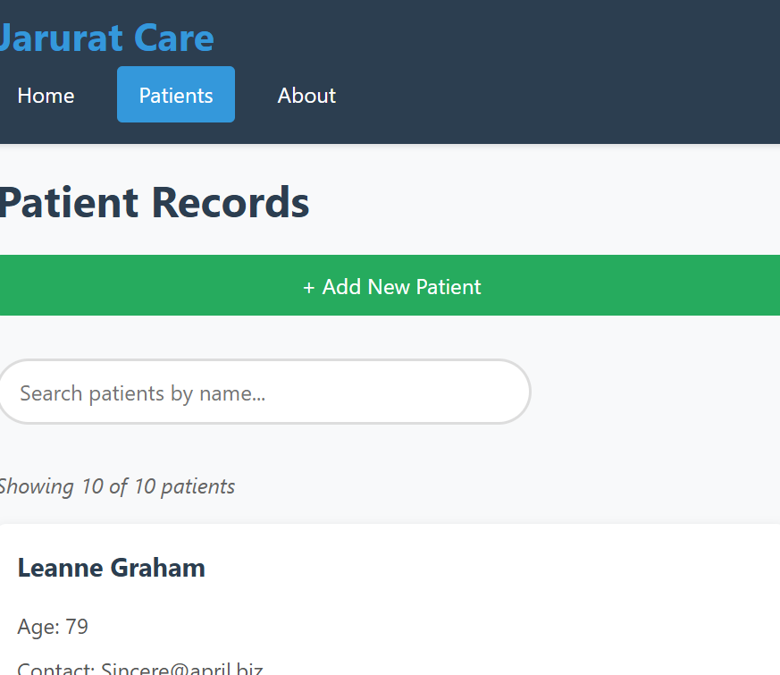
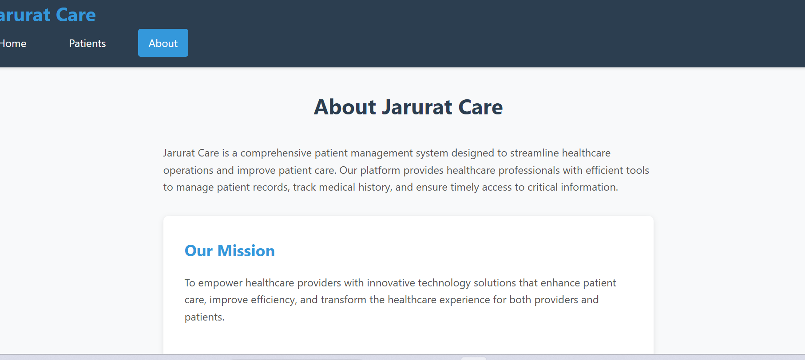

# Patient Records Dashboard 🏥

A modern, responsive React application for efficiently managing patient records with advanced search functionality.

###Home Page


###Patients Page


###Patients View Card


###Adding New Patient



###Search Functionality


##Mobile View



###About


## 🚀 Live Demo

[View Live Application]()

## ✨ Features

### 🔍 Smart Search

- Real-time patient search by name
- Instant filtering with clear results
- Advanced search capabilities

### 📱 Responsive Design

- Works perfectly on desktop, tablet, and mobile
- Modern, clean UI with intuitive navigation

### 💾 Efficient Data Management

- Fetch patient data from JSONPlaceholder API
- Add new patients locally
- View detailed patient information in modals

### 🛡️ Secure & Reliable

- Proper error handling
- Loading states for better UX
- Secure data management

## 🛠️ Technologies Used

- **Frontend**: React 18, React Router DOM
- **Styling**: CSS3 with Flexbox/Grid
- **API**: JSONPlaceholder REST API
- **Deployment**: Vercel/Netlify

## 📦 Installation & Setup

Follow these steps to run the project locally:

### Prerequisites

- Node.js (version 14 or higher)
- npm or yarn package manager

### Step 1: Clone the Repository

```bash
git clone https://github.com/BhavanasriM/patient-records-dashboard.git
cd patient-records-dashboard

```
